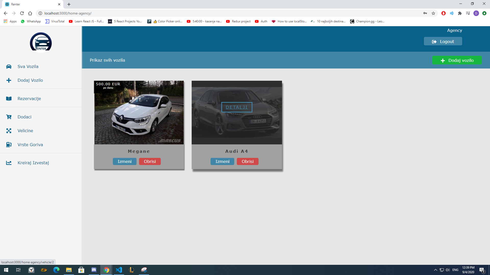

# Car Rental System - University Thesis

A Full Stack project made based on a [Renter](http://renter.ba/) system made in the past. Frontend was built in React, but modernized and updated, and backend waas build from scratch in Spring Boot Java, with MySQL.

The frontend web part of the application has two CMS systems - one for admin, one for agencies that promote their vehicles, to manage and manipulate all the data related to the given role. The reservations can be made from a mobile app or a new, end user web application. 

This project could still be extended with more technologies. OAuth2 + OpenID Connect, AWS S3 storage integration etc.
